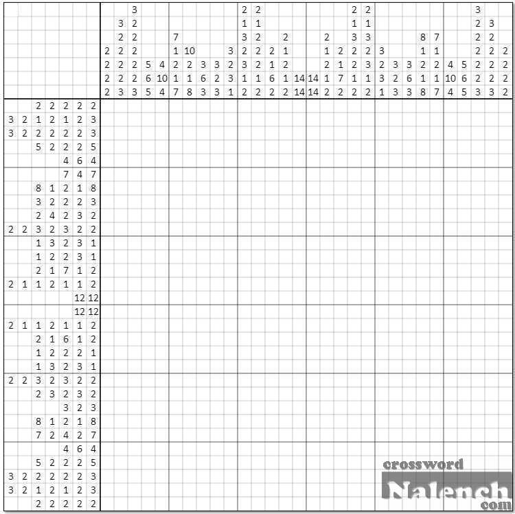
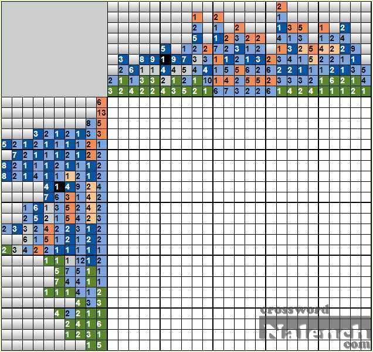

# Семестровое домашнее задание по АИСД
## Тема: Программа для решения японских кроссвордов (нонограмм)
Выполнила: Бояркина Елизавета, студент группы ИУ8-51


## Теоретическая часть
Японский кроссворд — головоломка, в которой с помощью цифр зашифровано некоторое изображение. Целью головоломки является 
полное восстановление этого изображения.

Японские кроссворды бывают двух видов — черно-белые и цветные. В черно-белых кроссвордах изображение содержит только 
два цвета — черный (которым картинка и заполняется) и белый (фоновый). В цветных кроссвордах изображение создается 
несколькими цветами на белом фоне.

Числа, указанные слева и сверху у кроссворда — описывают группы закрашенных клеток (идущих подряд, без пропусков) по 
горизонтали и вертикали соответственно. Порядок этих чисел описывает порядок расположения этих групп, но где 
каждая группа начинается и заканчивается — не известно (таким образом, определить их положение и является задачей 
головоломки). Каждое число обозначает отдельную группу заданного размера (т.е. число 3 - обозначает группу из 
трех закрашенных подряд клеток, 1 - группу из одной единственной закрашенной клетки). В черно-белых кроссвордах клетка 
всегда закрашивается черным цветом, в цветных — клетка закрашивается тем цветом, которым помечено число. Между 
группами одного цвета должна быть как минимум одна не закрашенная клетка, между группами разных цветов пустых клеток 
может не быть.

Главным требованием к японским кроссвордам является то, что кроссворд должен иметь единственное логическое решение, 
достижимое без "угадываний" (метода проб и ошибок).

Пример черно-белого кроссворда:



Пример цветного кроссворда:



## Формальная постановка задачи
Написать программу, которая будет правильно решать поданную ей на вход корректно составленную нонограмму. Корректной 
считается нонограмма, имеющая единственное решение. В случае, если поданная на вход нонограмма имеет несколько решений, 
программа должна подавать на выход какое-либо из них. При некорректном вводе должно выводиться сообщение об ошибке.

## Форматы входных и выходных данных
На вход программе первым аргументом командной строки подается адрес текстового файла, содержащего описание нонограммы.
Файл должен содержать в себе следующие поля: colors, lines, columns. Поле colors содержит в себе список идентификаторов
цветов, использованных для описания нонограммы (для одноцветной нонограммы нужно указать тот единственный идентификатор,
который будет использован для всех ячеек нонограммы). Идентификаторы вводятся через пробел. Поле lines содержит в себе 
последовательность массивов. Каждый массив содержит в себе описание соответствующей строки: первый массив описывает 
первую строку, второй — вторую и т.д. Каждый массив, описывающий новую строку, записывается с новой строки. Массив 
содержит в себе последовательность слов вида '5r', где 'r' - цвет группы, 5 - ее длина. Поле columns заполняется 
аналогично полю lines, только для столбцов. При этом матрица столбцов транспонируется — первая строка соответствует 
транспонированному первому столбцу, вторая — второму и т.д.
  
Пример корректного входного файла для цветной нонограммы:

```
colors: r b
lines:
2b 1r 1b
1b 1r

2b
3r
columns:
2b 1r
1b 1b 1r
2r 1b 1r
1b 1b
```

Программа выводит текстовый файл с решенным кроссвордом либо сообщение об ошибке. Если файл с решением нужно сохранить, 
то программе на вход нужно подать путь к файлу, в котором нужно сохранить картинку, аргументом -s командной строки. 
Пример корректного ввода:

```
./nonogram-solver input.txt
./nonogram-solver input.txt -s output.txt
```

## Известные алгоритмы решения
### Алгоритмы решения нонограмм, имеющих логическое решение
#### 1. Полный перебор
Для каждой клеточки перебираются все возможные варианты окраски, каждый полученный набор клеток проверяется на 
соответствие исходным условиям. Сложность такого алгоритма в общем виде для K цветов: O(N * M * K ^ (N * M)), где 
N, M - количество строк и столбцов, соответственно.
#### 2. Backtracking
Перебираются решения не для каждой клетки поотдельности, а для каждой горизонтальной группы клеток. Группы клеток 
переставляются в каждой строке, после чего каждый набор перестановок проверяется на соответствие исходным условиям.
Сложность такого алгоритма O(П(X_i) для i = 1...N), где X_i - число способов расставить горизонтальные группы в i-ой 
строке. Таким образом, если в худшем случае число перестановок для группы в строке - A, которое некоторым образом 
зависит от количества столбцов, количества горизонтальных групп в строке и их длины, то сложность алгоритма - O(A ^ N).
#### 3. Решение поочередно для каждого ряда
Каждый ряд и столбец анализируются поотдельности, после анализа для некоторых клеток устанавливается окончательное 
состояние, для некоторых - уменьшается количество цветов, в которые эту клетку можно окрасить. После этого строка 
и столбец, содержащие измененную клетку, перерассчитываются, так как изменение для этой клетки может повлечь изменение 
состояний остальных клеток. Сразу строку или столбец раскрыть нельзя, но изменения помогают раскрыть информацию для 
других клеток, и через несколько итераций для каждой клетки остается только один возможный цвет.
Сложность алгоритма в худшем случае O(N * M * Z) - в худшем случае одна итерация раскрывает информацию только об одной клетке,
Z - сложность алгоритма анализа строки.

Алгоритм анализа строки - пытаемся расставить группы строк так, чтобы они не нарушали уже заполненные клетки. Для этого 
пытаемся поставить первую группу с первой клетки, вторую - с (len_1 + 1) и т.д. Если расстановка нарушает уже известные
клетки - переходим на блок выше и ставим его в следующую клетку. Затем для каждой клетки анализируем все возможные 
варианты заполнения, сопоставляем с возможными до этого вариантами. Если для клетки остался только один возможный цвет - 
окрашиваем ее в него. Алгоритм рекурсивный, для уменьшения числа вызовов - храним в памяти возможность поставить i-й блок
начиная с j-й клетки (для каждого перерасчета для строки эта матрица заполняется заново). Тогда сложность алгоритма - 
сложность заполнения матрицы (A * B), где A - число блоков, B - число клеток (N или M, соответственно). Заметим, что при 
B = M получаем A <= N, а при B = N, A <= M. Тогда сложность расчета O(N * M), и итоговая сложность алгоритма - O(N^2 * M^2).

### Алгоритмы решения прочих нонограмм
Если нонограмма не имеет логического решения, то ее все еще можно решить первыми двумя алгоритмами (Полный перебор и 
Backtracking). Однако, также можно реализовать метод ветвей и границ на основе третьего алгоритма:
#### 4. Метод ветвей и границ
Сначала нонограмма максимально решается при помощи алгоритма 3. После того, как все клетки, которые можно логически 
решить, оказываются закрашенными, берется какая-либо клетка из незакрашенных и для нее перебираются все доступные цвета.
Сначала клетка окрашивается первым цветом, и если такой ее окрас не нарушает расстановку блоков в нонограмме, то снова 
запускается алгоритм 3, который окрашивает все, что с новой клеткой стало возможным рассчитать логически. Если и на этом
этапе не возникло противоречий, то либо нонограмма будет решена, либо мы находим еще какую-нибудь незакрашенную клетку и
рекурсивно применяем к ней алгоритм 4. Если же возникла ошибка, то выбранная нами клетка не может быть окрашена первым 
цветом - то есть, мы откатываем все изменения и красим клетку вторым цветом, если он тоже не подходит - третьим и т.д., 
пока нонограмма не будет решена либо пока не кончатся возможные цвета. Если закончатся все цвета, а решение так и не 
будет найдено, то это значит, что данная клетка не может быть окрашена ни одним цветом, а следовательно, нонограмма 
не имеет решения. Если это был промежуточный шаг рекурсии, то это значит, что нужно вернуться к предыдущей клетке и 
окрасить ее другим цветом. Если же мы находимся на первом шаге рекурсии, то это значит, что нонограмма не имеет решения 
вовсе и была записана некорректно.

При выполнении задания был реализован четвертый алгоритм.

## План решения
Язык реализации - Python

Идея алгоритма: поочередно проходим строки и столбцы и заполняем матрицу решения в соответствии с имеющейся информацией.
При заполнении какой-либо клетки - добавляем строку и столбец, на пересечении которых она лежит, в очередь. Алгоритм 
завершается, когда заканчивается очередь строк и столбцов, которые нужно проверить. Если при этом заполнена не вся 
матрица решения, то выбирается одна из клеток, для нее перебираются все возможные способы окраски и к каждому способу 
рекурсивно применяется этот алгоритм.

Примерная структура программы:
- функция-обработчик входного файла;
- функция, заполняющая строку (столбец) в соответствии с имеющейся информацией;
- функция, перебирающая варианты окраски для клетки, состояние которой мы пытаемся угадать;
- функция, непосредственно решающая нонограмму. Она вызывает функцию заполнения поочередно для строк и столбцов и 
  обновляет очередь из строк и столбцов, пока не будет заполнена вся матрица решений (или пока можно будет получить 
  новую информацию о решении);
- функция, представляющая полученное решение в виде выходного файла.

## Логика работы программы
Программа считывает данные из исходного файла, после чего преобрабатывает их для приведения в удобный для вычислений формат.
Производится простая проверка нонограммы на корректность (нет неопознанных цветов, количество клеток каждого цвета в информации
о строках и столбцах совпадает). После этого в соответствии с описанным выше алгоритмом (под номером четыре) 
производится расчет нонограммы. Если какая-либо клетка не может быть закрашена ни одним цветом (из-за некорректного
условия) - подается сообщение об ошибке. Если условие корректно, то на выход подается решенная нонограмма.

## Описание алгоритмов работы программы
Основные алгоритмы, использующиеся для решения нонограммы: file_reader, Nonogram.solve. Nonogram.solve в свою очередь использует
Nonogram.__presolve, Nonogram.__solve и Nonogram.__guess.
### file_reader
Функция, обрабатывающая входной файл. Она построчно проходит файл, составляя для каждой строки/столбца массив с информацией
о блоках, содержащихся в этой строке. Также эта функция производит предпроверку корректности введенных данных - проверяет,
что были указаны цвета, что нет неизвестных цветов, а также что количество клеток одного цвета в строках и столбцах совпадает.
На выходе функция образует объект класса Nonogram - нонограмму, готовую к решению.
Сложность функции: по времени - O((n + m) * k * log(max_block_length) + (n * m + n + m + colors)), 
где n и m - количество строк и столбцов, соответственно, k - максимальное кол-во блоков в строке, max_block_length - максимальная длина одного блока,
colors - количество цветов в нонограмме. В скобках - время, затрациваемое на создание нонограммы

по памяти: O(colors + n * k + m * k + Nonogram), где Nonogram - кол-во памяти, занимаемое нонограммой
O(Nonogram) = O(n * m + n * k + m * k + n + m + 1 + n * m * colors) = O(n * m * colors + n * k + m * k), итого:

время: O((n + m) * k * log(max_block_length) + n * m + colors)

память: O(n * m * colors + n * k + m * k)
### Nonogram.__presolve
Функция, производящая предрасчет для всех строк и столбцов. Для каждой строки (столбца) вычисляется минимальная длина, занимаемая
всеми блоками в ней. Если эта длина равна 0, то строка пустая и сразу может быть заполнена. Если эта длина равна длине строки,
то такая строка может быть заполнена единственным образом и тоже сразу заполняется. В прочих случаях в строке остается s пустых
клеток, которые могут как угодно сдвигать блоки по строке. Однако, каждый блок таким образом не может быть смещен более, чем
на s клеток относительно своего центра, а значит, если длина блока больше s, то можно закрасить (l - s) центральных клеток
в этом блоке. Таким образом, алгоритм сравнивает l и s и закрашивает центральные клетки, если это возможно, во всех строках и столбцах.
Сложность функции: по времени: O((n * k * max_colored_length + m * (n + k * max_colored_length)) = O(n * m + (n + m) * k * max_colored_length)),
где n, m, k - те же, что и выше, max_colored_length - длина наибольшего закрашенного куска (если ничего не было закрашено, считаем равной 1).

по памяти: O(n + m) - память тратится только на запоминание текущей расцветки строки и константные счетчики
### Nonogram.__solve
Функция, производящая аналитический расчет нонограммы, насколько это возможно. Поочередно проходим по всем строкам и столбцам, 
если они были изменены - производим новый расчет для данной строки (так как изменение может привести к раскрытию новой информации о некоторых клетках).
Произведение расчета для строки (столбца) осуществляется следующим образом: начиная с первой клетки пытаемся расставить имеющиеся
блоки по строке, при этом для снижения рекурсивных повторов заполняем матрицу, где в клетке [i][j] указано, можно ли поставить
i-й блок, начиная с j-й клетки. Также создаем массив, равный длине строки (столбца), в котором хранятся все возможные варианты окраски для каждой клетки.
Если после расчета какая-либо клетка может быть окрашена только одним цветом - закрашиваем ее, при этом записываем, что строка и столбец,
содержащие эту клетку, изменились. Повторяем, пока есть изменения в каких-либо строках и столбцах. После того, как закончились
изменяющиеся строки и столбцы, вызывается метод Nonogram.__guess.
Сложность: по времени: O((n * m) * (n * (m * k + m * k + m) + m * (n * k + n * k + n)) + Guess_time) = O(n ^ 2 * m ^ 2 * k + Guess_time),
где Guess_time - сложность по времени функции Nonogram.__guess

по памяти: O(n * (m + m * k) + m * (n + n * k) + Guess_memory) = O(n * m * k + Guess_memory), где Guess_memory - сложность по памяти
функции Nonogram.__guess
### Nonogram.__guess
Функция, реализующая угадывание недостающих клеток методом ветвей и границ. Так как нет никаких оснований полагать, что если начинать
угадывание с каких-то определенных клеток (из середины, с конца или из начала, случайно выбирать клетки), то метод ветвей и границ
будет работать быстрее, то можно выбирать текущую раскрашиваемую клетку каким угодно образом. В моей реализации алгоритм
раскрашивает самую верхнюю левую клетку, которая еще не раскрашена. Сначала ищем еще не закрашенную клетку. Если все клетки уже закрашены,
то нонограмма решена, алгоритм завершается. В противном случае останавливаемся в первой не раскрашенной клетке. Пытаемся ее
раскрасить каким-либо цветом из возможных, и запускаем функцию Nonogram.__solve, которая аналитически рассчитает все, что сможет,
и затем снова рекурсивно вызовет Nonogram.__guess. Если функция Nonogram.__solve сгенерирует исключение, то это будет означать,
что какая-то из клеток не может быть окрашена никаким цветом, а значит, либо нонограмма не может быть раскрашена в принципе, 
либо мы неверно предположили цвет для текущей клетки. Если у нас еще остались возможные цвета окраски для текущей клетки, то
пробуем окрасить ее каким-либо из них. Если же цвета закончились, то это значит, что для текущей клетки не подходит ни один
из возможных цветов, а значит, нонограмма не может быть решена. Если функция Nonogram.__solve не вернула искючение,
а отработала корректно, то это значит, что наше предположение цвета для текущей клетки оказалось верным и нонограмма была решена,
в этом случае алгоритм завершает свою работу.
Сложность: по времени: O(n * m + colors + n * m * colors + colors * (Solve_time + n * m * colors)) = O(n * m * colors ^ 2 + colors * Solve_time),
где Solve_time - сложность работы функции Nonogram.__solve по времени

по памяти: O(colors + n * m * colors + Solve_memory) = O(n * m * colors + Solve_memory), где Solve_memory - сложность функции
Nonogram.__solve по памяти
### Nonogram.solve
Функция, решающая нонограмму. Сначала производит предобработку при помощи функции Nonogram.__presolve, затем решает нонограмму
функцией Nonogram.__solve.
Сложность: по времени: O(n * m + (n + m) * k * max_colored_length) + n ^ 2 * m ^ 2 * k + Guess_time) = (n ^ 2 * m ^ 2 * k + Guess_time) =
(n ^ 2 * m ^ 2 * k + n * m * colors ^ 2 + colors * Solve_time)

по памяти: O(n + m + n * m * k + Guess_memory) = (n * m * k + n * m * colors + Solve_memory) = (n * m * (k + colors))

### Итоговая сложность алгоритма:

по времени: O((n + m) * k * log(max_block_length) + n * m + colors + n ^ 2 * m ^ 2 * k + n * m * colors ^ 2 + colors * Solve_time) =
(n ^ 2 * m ^ 2 * k + n * m * colors ^ 2 + colors * Solve_time)

по памяти: O(n * m * colors + n * k + m * k + n * m * (k + colors)) = O(n * m * (k + colors))

## Инструкция по компиляции
Python - скриптовый язык, поэтому код можно запускать без компиляции в интерпретаторе python. Если такой возможности нет,
то можно выбрать архив для нужной ОС из релиза или скомпилировать самостоятельно при помощи библиотеки pyinstaller:
```
pyinstaller nonogram-solver nonogram_solver.py
```

## Описание тестов
Тесты, проверяющие корректность решения нонограмм программой (входные файлы лежат в папке tests/input, выходные - в папке tests/output):
1-3 - тесты, проверяющие, что алгоритм корректно работает для черно-белых нонограмм небольшого размера
4-6 - тесты, проверяющие, что алгоритм корректно работает для цветных нонограмм небольшого размера
big_one_color - тест, проверяющий, что алгоритм корректно работает для большой черно-белой нонограммы
big_many_colors - тест, проверяющий, что алгоритм корректно работает для большой цветной нонограммы. Также проверяется моноширинный вывод для всех блоков
guess_test - тест, проверяющий, что алгоритм корректно работает для нонограммы, не имеющей логического решения
Тесты, проверяющие, что алгоритм обрабатывает некорректный ввод для нонограмм (входные файлы лежат в папке tests/exceptions):
no_colors - тест, проверяющий, что алгоритм выдает ошибку, если ему подается входной файл без указания цветов
unknown_color - тест, проверяющий, что алгоритм выдает ошибку, если во входном файле есть неизвестный цвет
incorrect_colors - тест, проверяющий, что алгоритм выдает ошибку, если ему на вход был подан файл с некорректно введенными цветами
no_solution - тест, проверяющий, что алгоритм выдает ошибку, если ему на вход был подан файл, не имеющий решения
